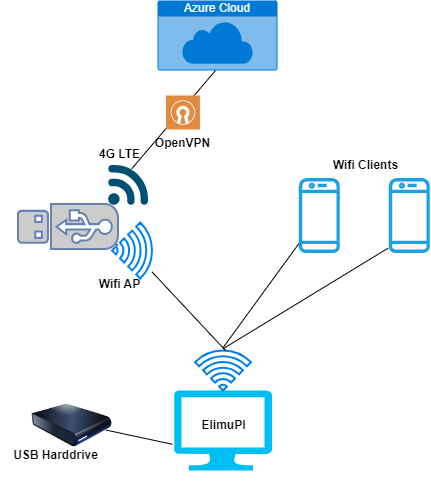

## ElimuPi-Connect project manual for trainers

## **Introduction**

The purpose of this document is to provide an overview of ElimuPi-Connect project features and act as a trainer's manual.

**Overview of the trainer manual**

This manual highlights the importance of the product and the trainer's role in implementing the product. It explains the training objectives and the key messages that each trainers needs to convey about the product during the sessions. It also highlights the technical details that trainers need to be aware of and how to troubleshoot common issues that may be encountered.

Demonstration guidelines are also provided for effective demonstration of the product. The manual also indicates frequently asked questions that can be expected about the product and answers to those questions.

It is imperative that the trainers follow the hands-on exercises provided to reinforce key concepts about the product.

**Importance of the trainer's role in implementing the product**

 - Trainers play a crucial role in effective knowledge transfer about the product to end-users. Their ability to explain complex technical concepts in a clear and understandable manner ensures that school staff can confidently use and troubleshoot the system.
 - Trainers can adapt the training sessions to the specific needs and environments of different schools.
 - Trainers contribute to building confidence among school staff by offering hands-on experience and practical guidance.
 - Trainers can foster collaboration among teachers, administrators, and IT staff.
 -  Trainers play a key role in ensuring the smooth integration of the product into existing school systems and practices.
 -  Trainers serve as a primary point of contact for ongoing support.
 - Trainers are in a unique position to gather valuable feedback from school staff during and after training sessions.
 - Trainers empower teachers to become advocates for the product within their schools.
 - Trainers contribute to building a long-term relationship between the organization and the schools.

 **Training Objectives**

Clear objectives for trainers.

1.  Ensure understanding of the product basics by the schools' staff.
2.  Facilitate Customization for school environments.
3.  Demonstrate integration with school systems.
4.  Emphasize security and privacy considerations.
5.  Gather feedback for continuous improvement.
6.  Establish ongoing support channels.

Key messages to convey during training sessions.

 - Emphasize that ElimuPi-Connect provides a comprehensive solution, offering internet connectivity, VPN access, and a centralized portal for efficient device management.
 -  Highlight how ElimuPi-Connect empowers schools by providing internet access for multiple devices, enhancing the educational experience for both students and teachers.
 -  Convey that trainers and the organization are committed to providing ongoing support, ensuring a positive and sustained experience with ElimuPi-Connect.
 -  Stress the importance of maintaining privacy and security, both in terms of device usage and data transmission, to instill confidence among school staff and students.

## **Technical Details**

**Product Components**

The following is a breakdown of the ElimuPi-Connect project components:

-   A ElimuPi-Connect device that provides Internet via a wireless access point (AP) for other Wi-Fi devices to connect to and comes with a web based portal for registering the school granted device.
-   A 4G LTE USB Wi-Fi Dongle that provides a high-speed mobile Internet connection using a SIM card. It can be used as USB device or act as a wireless access point (AP) for other Wi-Fi devices to connect to.
-   A ElimuPi device that provides offline educational content from a USB connected hard disk and is accessible via a wireless access point (AP) for other Wi-Fi devices to connect to.
-   Tablets.

  **Network Configuration**

 

The following is a description of the ElimuPi-Connect project as demonstrated above.

The ElimuPi-Connect device primary function is to provide Internet connectivity for other devices. It does so by exposing an Wi-Fi based Access Point (AP) named  _elimu-connect_  that other devices can connect to. The ElimuPi-Connect device uses the 4G LTE USB Wi-Fi Dongle for connection to the Internet. The ElimuPi-Connect device will establish a VPN connection to DEAN's content and management hub platform when connected to the Internet.

The ElimuPi device primary function is to provide offline educational content. It does so by exposing an Wi-Fi based Access Point (AP) named  _elimu_  that other devices can connect to and access the web based content served by URL  [http://start.elimupi.online](http://start.elimupi.online/)  by inserting it to a suitable power outlet The ElimuPi device will automatically try to connect to the ElimuPi-Connect device if within Wi-Fi range. The main goals of interconnecting the ElimuPi device with the ElimuPi-Connect device is to provide content updates and remote management to the ElimuPi-Connect device.

 **Portal functionality**

When connected to The ElimuPi-Connect Wi-Fi based Access Point (AP) named _elimu-connect_, a web based portal will be available and accessible via URL  [http://registration.elimupi.online](http://registration.elimupi.online/)  that allows trainers to register the school issued with the device(s). The portal has a section for registering the school (s), ElimuPi-Connect device(s) and ElimuPi device(s).

 **Demonstration Guidelines**  :

Step-by-step guide for trainers to effectively demonstrate the product.

 - Ensure the 4G LTE USB Wi-Fi Dongle has a SIM card inserted providing internet capabilities.
 - Power on the 4G LTE USB Wi-Fi Dongle by inserting it's USB port into the provided power source adapter and then insert the power adapter to a suitable power outlet.
 - Power on the ElimuPi-Connect device by inserting it to a suitable power outlet.
 - Power on the ElimuPi device by connecting it to suitable power outlet and wait for at approximately 2 minutes to startup.
 - Connect a tablet or computer device to the Wi-Fi network named  _elimu-connect_.
 - On the tablet or computer device point the browser to  [http://start.elimupi.online](http://start.elimupi.online/).
 - On the bottom of the page click on the  _Register School_  icon which will direct to  [http://registration.elimupi.online](http://registration.elimupi.online).
 - On the page  [http://registration.elimupi.online](http://registration.elimupi.online)  login to the portal with username  _admin_  and password  _topsecet._
 - To register the school on left-hand sidebar menu of the page select  _Register School_ and under  _Name_  provide at least the full name of the school and under  _School Code_  the code of the school. (e.g. Genesis Joy School as  _Name_  and  _gjs_  as  _School Code)._  Also fill in  _City_  and  _Address_  and when done click on the  _Register_  button at the bottom of the page. The school should now be registered having its unique school code.
 - To register ElimuPi-Connect device on left-hand sidebar menu select  _Register Connect_  and fill in Under  _Name_  the school code under and  _School code_  : connect-(school-code)-001 e.g. connect-xyz-001 and when done click on the  _Register_  button at the bottom of the page. The ElimuPi-Connect device should now be registered for the school.
 -  To register ElimuPi device on left-hand sidebar menu select  _Register ElimuPi_  and fill in in lowecase Under  _Name_  the school code under and  _School code_  : elumpi-(school-code)-001 e.g. elumpi-xyz-001 and when done click on the  _Register_  button at the bottom of the page. The ElimuPi-Connect device should now be registered for the school.

 **Troubleshooting tips for common issues trainers may encounter.**

 - Lack of internet connection via ElimuPi-ConnectWi-Fi.

If encountered with this issue, check the SIM card in the 4G dongle whether it has internet bundles or a data plan. If it does not, instruct the school to purchase the necessary data plans. If it has, contact support for further guidelines.

 **Suggestions on engaging with the audience during training.**

 - Showcase and explain how the internet connection works.
 - Ensure to demonstrate using a tablet or laptop or computer how the internet connection can be used.

## **FAQs for Trainers**

 ****Anticipated questions from the audience:**

1.  ****Q: How does the**  **ElimuPi-Connect device**** provide internet access?

-   A: The ElimuPi-Connect device serves as an Access Point (AP) that creates a wireless local area network (WLAN). When connected with the 4G dongle it connects to Internet and establishes a VPN connection to DEAN's content and management hub platform.

2.  **Q: What is the role of the 4G dongle in the**  **ElimuPi-Connect**  **setup?**

-   A: The 4G dongleprovides a high-speed mobile Internet connection using a SIM card. It can be used as USB device or act as a wireless access point (AP) for other Wi-Fi devices to connect to.

3.  **Q: How do I register a school and its devices on the Elimu-Connect portal?**

-   A: Access the portal via  [http://registration.elimupi.online](http://registration.elimupi.online/), log in with admin credentials, click on "Register School," and follow the prompts to register the school, ElimuPi-Connect devices, and ElimuPi devices.

4.  **Q: Can devices connect to both**  **ElimuPi-Connect device**  **and ElimuPi Wi-Fi networks simultaneously?**

-   A: Yes, devices such as tablets and computer devise can connect to both ElimuPi-Connect and ElimuPi Wi-Fi networks based on requirements.

5.  **Q: What should I do if there is no internet connection via**  **ElimuPi-Connect**  **Wi-Fi?**

-   A: Check the SIM card in the 4G dongle for internet bundles or a data plan. If not available, instruct the school to purchase the necessary data plans. Contact support for further guidance if needed.

**Detailed responses and explanations for trainers:**

1.  **A: ElimuPi-Connect Internet Access:**

-   The ElimuPi-Connect device acts as an Access Point (AP) creating a Wi-Fi network. It also connects to DEAN's server via VPN through the 4G dongle, providing internet access for connected devices.

2.  **A: Role of 4G Dongle:**

-   The 4G dongle connects to the ElimuPi-Connect device, supplying internet connectivity through sim cards. It is a crucial component for creating the Wi-Fi network and enabling internet access.

3.  **A: Registration on the ElimuPo-Connect Portal:**

-   Access the portal at  [http://registration.elimupi.online](http://registration.elimupi.online/), log in with admin credentials, and use the "Register School" section to register schools, Elimu-Connect devices, and ElimuPi devices.

4.  **A: Simultaneous Connections:**

-   Yes, devices like tablets can connect to both ElimuPi-Connect and ElimuPi Wi-Fi networks based on their requirements and usage scenarios.

5.  **A: No Internet Connection Troubleshooting:**

-   If there's no internet connection via ElimuPi-Connect Wi-Fi, check the 4G dongle's SIM card for internet bundles. If unavailable, advise the school to purchase data plans. For further assistance, contact our support team.
